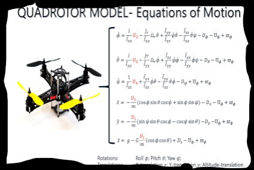
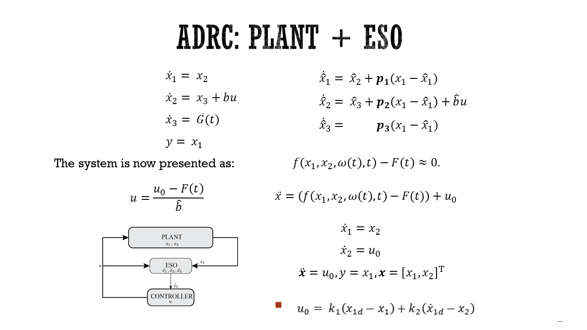
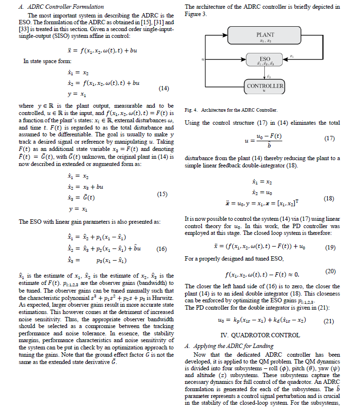
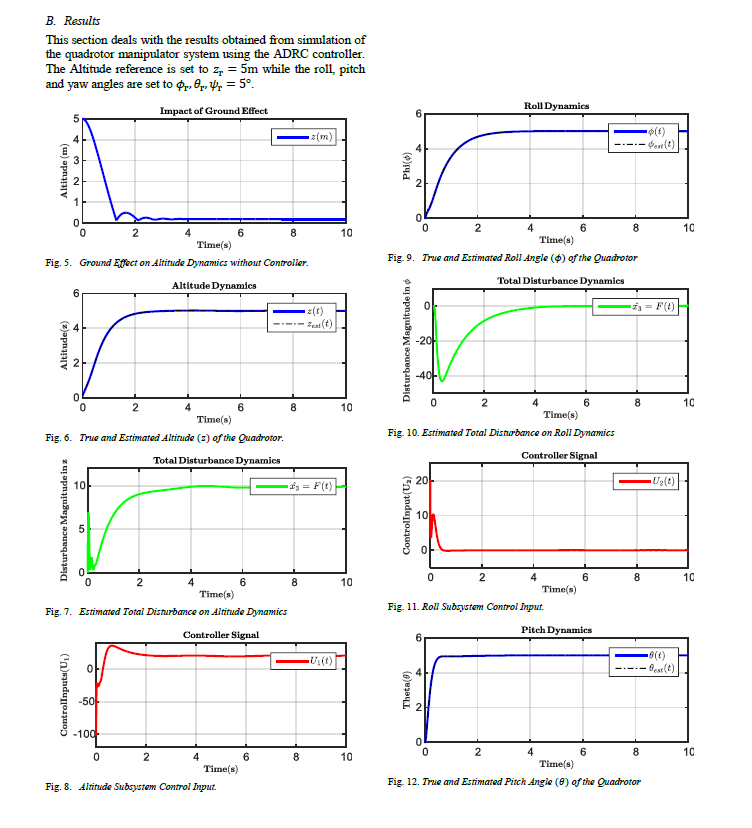

# Active Disturbance Rejection Controller

## Introduction  

 ADRC uses an Extended state observer to linearize the Quadrotor's Nonlinear dynamics (similar to Feedback linearization). This makes it capable of eliminating disturbances (robustness).

  

## Description  
Disturbance observers are known for their use in the estimation of unmeasurable dynamics in a plant. An ADRC controller as the name implies actively cancels disturbances and unwanted dynamics. It is based on the concept of an extended state observer (ESO). An extended state observer is a type of disturbance observer that estimates combined or total disturbances in a plant by introducing a fictitious state (also known as the extended state) that represents the unknown or unwanted dynamics. After estimation of the unknown dynamics, a feedback linearization-type operation is used to cancel out the total disturbance from the plant dynamics. This implies that the control affine plant transforms to a linear feedback integrator system. As a result, linear control theory can be applied. It is thus intuitive that the performance of the controller is dependent on the accuracy, speed and performance of the ESO.  
   
  
  
  
## Results  
  
  
